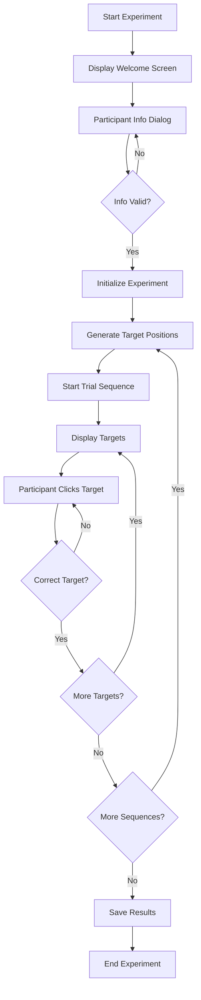

# GoFitts Experiment

This repository contains the PsychoJS version of the GoFitts task. The
`index.html` file is set up for deployment on the [JATOS](https://www.jatos.org/) platform.

## Experiment Flow

## Running on JATOS

Upload the entire folder as a JATOS component. The experiment will
start automatically once JATOS has loaded and results will be stored by
JATOS.
